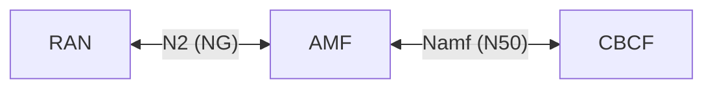
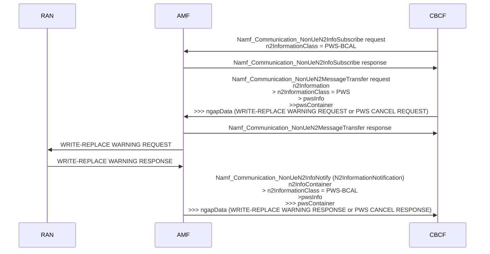
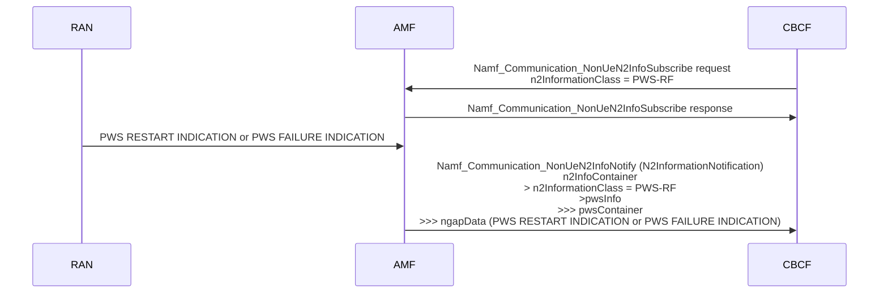

# 5G Public Warning System (PWS)

## Specs

Main spec

- 3GPP TS 23.041 Technical realization of Cell Broadcast Service (CBS)  

Related specs:

- 3GPP TS 29.518 5G System; Access and Mobility Management Services; Stage-3
- 3GPP TS 29.501 5G System; Principles and Guildelines for Service Definition; Stage-3
- 3GPP TS 38.413 NG-RAN; NG Application Protocol (NGAP)

## Network functions and interfaces:




## Start, stop/cancel operations

**WRITE-REPLACE-WARNING-REQUEST-NG-RAN Request/Indication primitive**<a id="b6b6a7"></a>

- Signaling direction: CBCF > AMF > NG-RAN
- AMF service: Namf_Communication_NonUeN2MessageTrasfer request
- NGAP message: WRITE-REPLACE WARNING REQUEST

```txt
Namf_Communication_NonUeN2MessageTrasfer request (N2InformationTransferReqData)
  tailList
  ratSelector
  globalRanNodeList
  n2Information (N2InfoContainer)*
    n2InformationClass* = PWS
    pwsInfo (PWSInformation)
      messageIdentifier*
      serialNumber*
      pwsContainer (N2InfoContent)*
        ngapMessageType
        ngapData* (WRITE-REPLACE WARNING REQUEST or PWS CANCEL REQUEST)
      sendRanResponse
      nfId
```

**WRITE-REPLACE-WARNING-CONFIRM-NG-RAN Response/Confirm primitive**<a id="b8abcc"></a>
  
- Signaling direction: AMF > CBCF
- AMF service: Namf_Communication_NonUeN2MessageTrasfer response

```txt
Namf_Communication_NonUeN2MessageTrasfer response (N2InformationTransferRspData)
  result*
  pwsRspData (PWSResponseData)
    ngapMessageType*
    serialNumber*
    messageIdentifier*
    unknownTaiList
    n2PwsSubMissInd
```

**WRITE-REPLACE-WARNING-INDICATION-NG-RAN Request/Indication primitive**<a id="accfef"></a>
  
- Signaling direction: NG-RAN > AMF > CBCF
- AMF services
	- Namf_Communication_NonUeN2InfoSubscribe with `PWS-BCAL`
	- Namf_Communication_NonUeN2InfoNotify
- NGAP message: WRITE-REPLACE WARNING RESPONSE

```txt
Namf_Communication_NonUeN2InfoSubscribe request (NonUeN2InfoSubscriptionCreateData)
  globalRanNodeList
  anTypeList
  n2InformationClass* = PWS-BCAL
  n2NotifyCallbackUri*
  nfId
```

```txt
Namf_Communication_NonUeN2InfoSubscribe response (NonUeN2InfoSubscriptionCreatedData)
  n2NotifySubscriptionId*
  n2InformationClass = PWS-BCAL
```
  
```txt
Namf_Communication_NonUeN2InfoNotify (N2InformationNotification)
  n2NotifySubscriptionId*
  n2InfoConatiner
    n2InformationClass = PWS-BCAL
    pwsInfo (PWSInformation)
      messageIdentifier*
      serialNumber*
      pwsContainer (N2InfoContent)*
        ngapMessageType
        ngapData (WRITE-REPLACE WARNING RESPONSE or PWS CANCEL RESPONSE)
      bcEmptyAreaList
  notifyReason
```

**STOP-WARNING-REQUEST-NG-RAN Request/Indication primitive**
  
- Signaling direction: CBCF > AMF > NG-RAN
- AMF service: Namf_Communication_NonUeN2MessageTrasfer request
- NGAP message: PWS CANCEL REQUEST

See [b6b6a7](5G%20Public%20Warning%20System%20(PWS).md#user-content-b6b6a7) for HTTP
  
**STOP-WARNING-CONFIRM-NG-RAN Response/Confirm primitive**
  
- Signaling direction: AMF > CBCF
- AMF service: Namf_Communication_NonUeN2MessageTrasfer response

See [b8abcc](5G%20Public%20Warning%20System%20(PWS).md#user-content-b8abcc) for HTTP
  
**STOP-WARNING-INDICATION-NG-RAN Request/Indication primitive**
  
- Signaling direction: NG-RAN > AMF > CBCF
- AMF services:
	- Namf_Communication_NonUeN2InfoSubscribe with `PWS-BCAL`
	- Namf_Communication_NonUeN2InfoNotify
- NGAP message: PWS CANCLE RESPONSE

See [accfef](5G%20Public%20Warning%20System%20(PWS).md#user-content-accfef) for HTTP
  
> [!WARNING] Only non-trivial IEs are mentioned in the sequence diagram
  

  
## Restart/failure indication operations
  
**RESTART-INDICATION-NG-RAN Request/Indication primitive**<a id="697361"></a>
  
- Signaling direction: NG-RAN > AMF > CBCF
- AMF services
	- Namf_Communication_NonUeN2InfoSubscribe with `PWS-RF`
	- Namf_Communication_NonUeN2InfoNotify
- NGAP message: PWS RESTART INDICATION

```txt
Namf_Communication_NonUeN2InfoSubscribe request (NonUeN2InfoSubscriptionCreateData)
  globalRanNodeList
  anTypeList
  n2InformationClass* = PWS-RF
  n2NotifyCallbackUri*
  nfId
```

```txt
Namf_Communication_NonUeN2InfoSubscribe response (NonUeN2InfoSubscriptionCreatedData)
  n2NotifySubscriptionId*
  n2InformationClass = PWS-RF
```

```txt
Namf_Communication_NonUeN2InfoNotify (N2InformationNotification)
  n2NotifySubscriptionId*
  n2InfoConatiner
    n2InformationClass = PWS-RF
    pwsInfo (PWSInformation)
      messageIdentifier*
      serialNumber*
      pwsContainer (N2InfoContent)*
        ngapMessageType
        ngapData (PWS RESTART INDICATION or PWS FAILURE INDICATION)
      bcEmptyAreaList
  notifyReason
```
  
**FAILURE-INDICATION-NG-RAN Request/Indication primitive**
  
- Signaling direction: NG-RAN > AMF > CBCF
- AMF services:
	- Namf_Communication_NonUeN2InfoSubscribe with `PWS-RF`
	- Namf_Communication_NonUeN2InfoNotify
- NGAP message: PWS FAILURE INDICATION

See [697361](5G%20Public%20Warning%20System%20(PWS).md#user-content-697361) for HTTP
  
> [!WARNING] Only non-trivial IEs are mentioned in the sequence diagram
  

